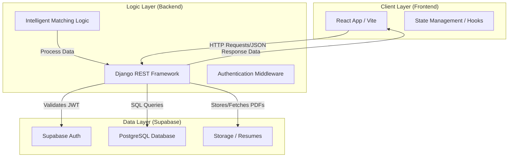

# SkillMesh - Intelligent Talent Matching Platform

Full-stack web app (Indeed/Seek style) with role-based candidate and employer workflows.

## 🏗️ System Architecture



## 🚀 Tech Stack
* **Frontend:** React (Vite) 
* **Backend:** Python (Django + Django REST Framework)
* **Database:** PostgreSQL (Hosted on Supabase)
* **Architecture:** Decoupled Monorepo

## Quick Start

### Backend
```bash
git clone https://github.com/your-org/SkillMesh.git
cd SkillMesh
```

### 2. Environment Variables (CRITICAL)
**Never commit `.env` files to GitHub.** You will need to create two separate `.env` files—one for the frontend and one for the backend. Reach out to the Lead Developer to get the required Supabase URI and API keys.

**Backend `.env`** (Create this file inside the `backend/` folder):
```text
DATABASE_URL=your_provided_database_url
DJANGO_SECRET_KEY=your_provided_secret_key
DEBUG=True
```

**Frontend `.env`** (Create this file inside the `frontend/` folder):
```text
VITE_SUPABASE_URL=your_provided_supabase_url
VITE_SUPABASE_ANON_KEY=your_provided_anon_key
```

### 3. Backend Setup (Django)
Open a terminal in the root `SkillMesh` folder.

```bash
cd backend
python3 -m pip install -r requirements.txt
python3 manage.py makemigrations
python3 manage.py migrate
python3 manage.py runserver
```
*The backend should now be running at `http://127.0.0.1:8000/`*

### 4. Frontend Setup (React/Vite)
Open a **new, separate terminal window**, navigate to the root `SkillMesh` folder, and run:

```bash
# 1. Navigate to the frontend folder
cd frontend

# 2. Install Node dependencies
npm install

# 3. Start the Vite development server
npm run dev
```
*The frontend should now be running at `http://localhost:5173/` (or port 3000).*

---

## 📁 Repository Structure
```text
SkillMesh/
├── backend/                # Django Application
│   ├── manage.py
│   ├── mysite/             # Core settings and routing
│   └── api/                # Endpoints and recommendation logic
├── frontend/               # React Vite Application
│   ├── src/                # UI Components and pages
│   └── package.json
├── .gitignore              # Protects secrets and heavy node/python modules
└── README.md
```

## 🌿 Git Workflow Rules
1. **Never push directly to `main`.**
2. Create a new branch for your feature: `git checkout -b feature/your-feature-name`
3. Commit your changes: `git commit -m "Add candidate profile form"`
4. Push to your branch and open a Pull Request (PR) for code review.
